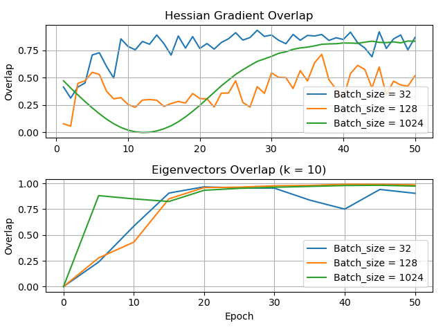
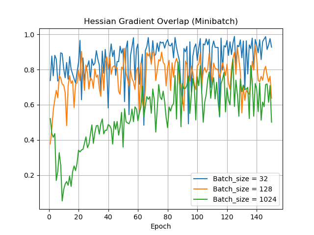

# CSC2541_Project
In this repository, I share the codes I wrote for the Colab.

There are two main parts: **full_batch_experiments.py** and **mini_batch_experiments.py**. The hessian computations are done in **hessian_computation.py**. The top k ( = 10) eigenvectors and eigenvalues of the Hessian is computed by using the Lanczos method, implemented in **lanczos.py**.

* In both main parts, I only considered a two-layer FC model (with 128-dimensional hidden units, ReLu activations, run on MNIST dataset). As the optimizer, I used SGD with heavy-ball momentum (learning_rate = 0.001, momentum = 0.9).

* In full_batch_experiments.py, hessian-gradient overlaps and eigenvector overlaps are computed by using all training-data (i.e., both gradients and Hessians are computed by using all data, not minibatch). Hessian-gradient overlaps are computed at the end of each epoch, whereas eigenvector overlaps are computed at the end of each five-epoch period (and overlaps are calculated with respect to the eigenvectors computed five epochs before). I run a simple experiment with batch sizes of 32, 128, and 1024. The plot is given below (left).

* In mini_batch_experiments.py, only hessian-gradient overlaps are computed. They are computed by using mini-batches at each time-step. The overlap of an epoch is set to the mean of the overlaps computed during that epoch. Here as well, I run a simple experiment with batch sizes of 32, 128, and 1024. The plot is given below (right).

   
  

